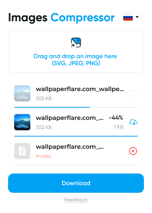
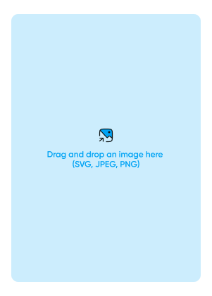
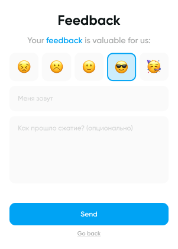

# Image Compressor 

Инструмент для сжатия изображений 🛡️

Файлы обрабатываются **исключительно на клиенте**, что гарантирует защиту и конфиденциальность данных.

---

## Скриншоты 📸

  
  
  

---

## Преимущества ✅

- Поддержка форматов: **SVG, JPEG, PNG, WebP**.
- Удобный интерфейс с поддержкой **Drag & Drop**.
- Сжатие без потери качества.
- Возможность обратной связи.
